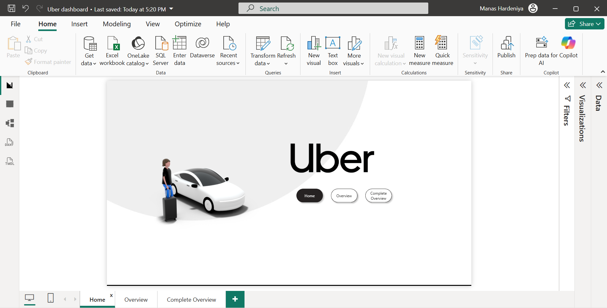

# 🚖 Uber Sales Dashboard

## 📊 Project Overview
This project presents an interactive dashboard built using Power BI to analyze Uber ride data.  
It provides insights into booking trends, revenue patterns, and customer behavior.

---

## 🛠️ Tools Used
- Power BI

---

## 📌 Key Features
- Ride booking trend analysis
- Revenue and profit insights
- Peak hours and demand analysis
- Customer and location-based insights

---

## 📷 Dashboard Preview

### 🔹 Page 1

### 🔹 Page 2

### 🔹 Page 3

---

## 📄 Full Dashboard File
👉 [Download Dashboard PDF](dashboard.pdf)

---

## 🚀 Insights Gained
- Identified peak booking hours and high-demand locations  
- Analyzed revenue trends across different time periods  
- Found patterns in customer ride behavior  

---

## 📬 Contact
**Manas Hardeniya**  
📧 manashardeniya1@gmail.com  
📍 Noida, India
